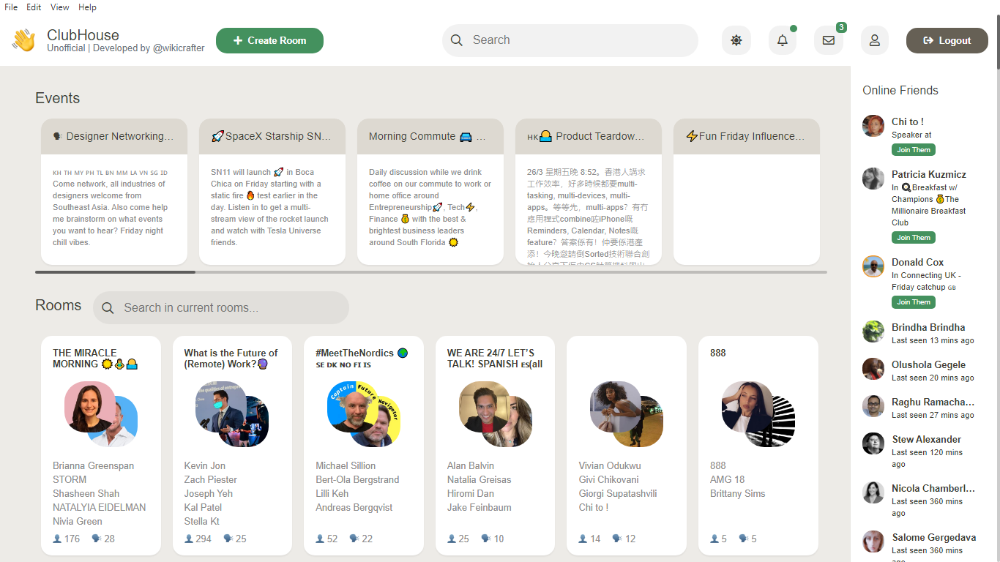

# clubhouse-desktop

This is an unofficial desktop client for the currently trending ClubHouse.

# Any bans on the accounts is possible so use it at your own risk!

Developed Using Electron JS + Vue JS + AgoraSDK.

To download already builded app open folder named <a href="ZipFiles">ZipFIles</a> and download it.

The source code is a little bit  mess, but since it's been developed in a hurry (about 30-40hrs) to get it working and also since it was  first time using Electron, Vue, and Agora.
So if you think it's a mess, feel free to make it clean and create a pull request.

# Screenshot

# How to run source code locally
1. Clone repo
2. In directory install npm
3. Run `npm start` to run the project

# How to build source code
1. yarn run
2. electron-builder (choose for which OS you want to build it, if you want for macos you must to build it with macos)

Inspired by <a href="https://github.com/callmearta/clubhouse-desktop">Arta</a>
